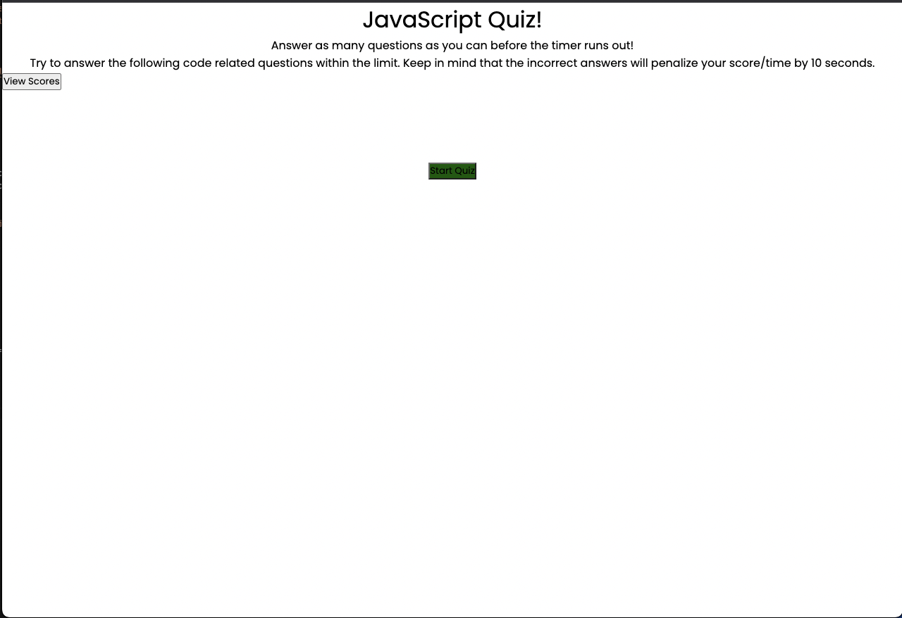
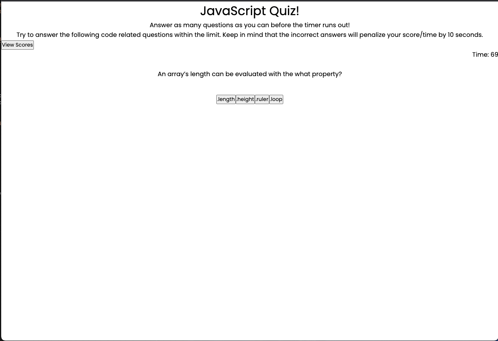
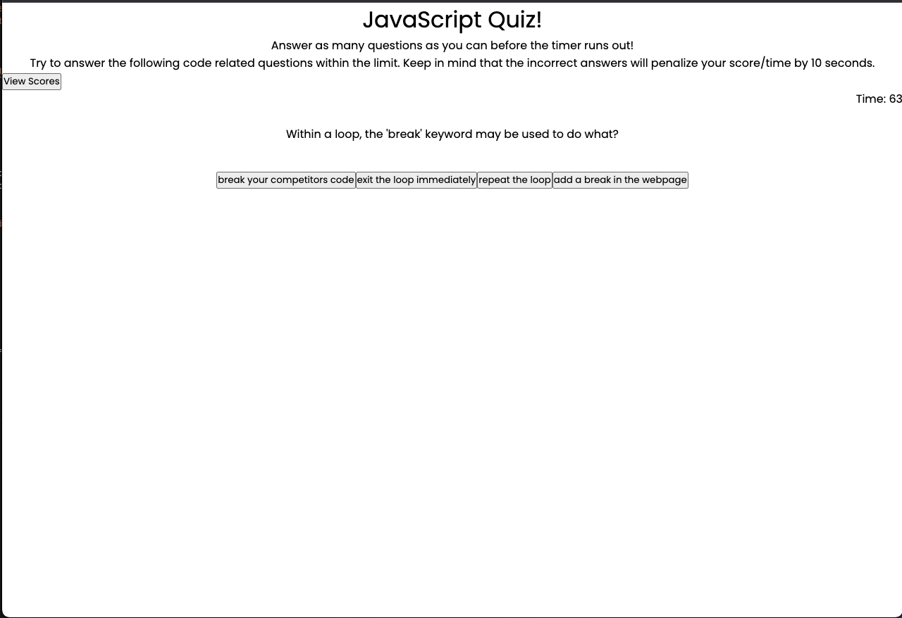
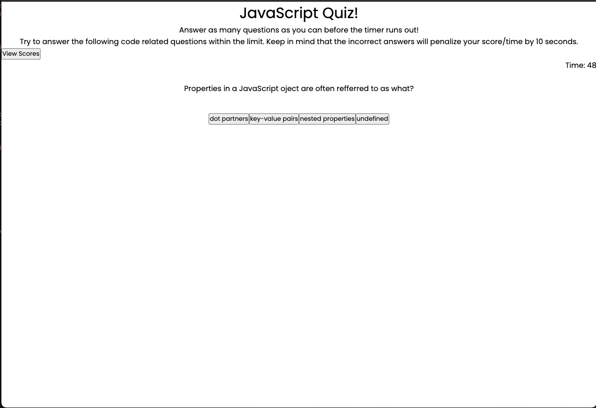
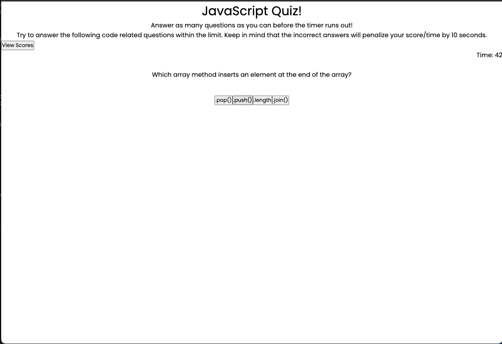
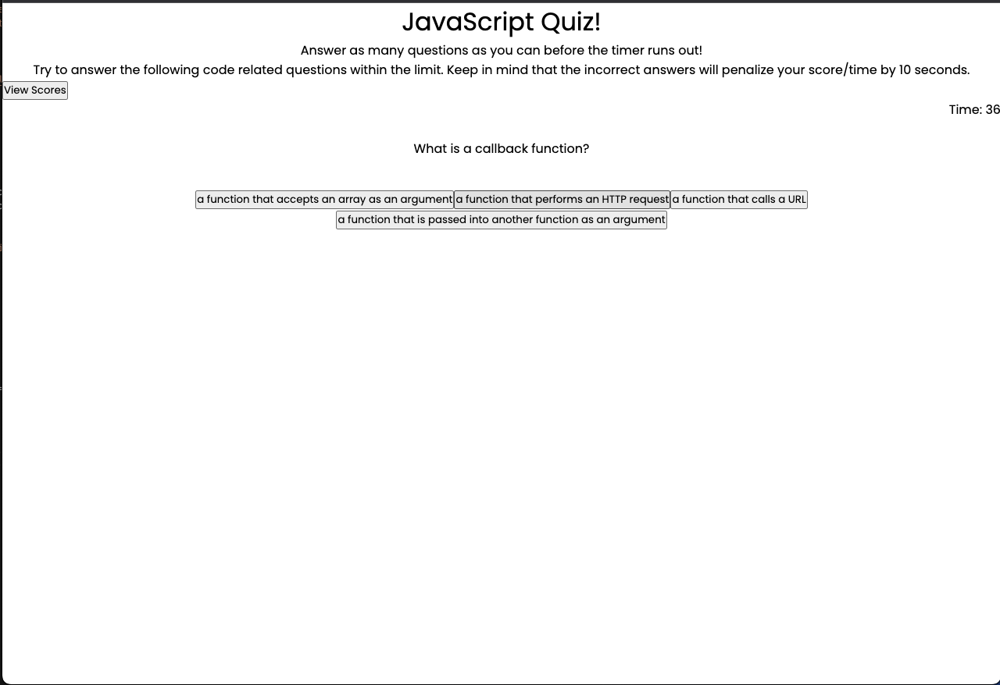
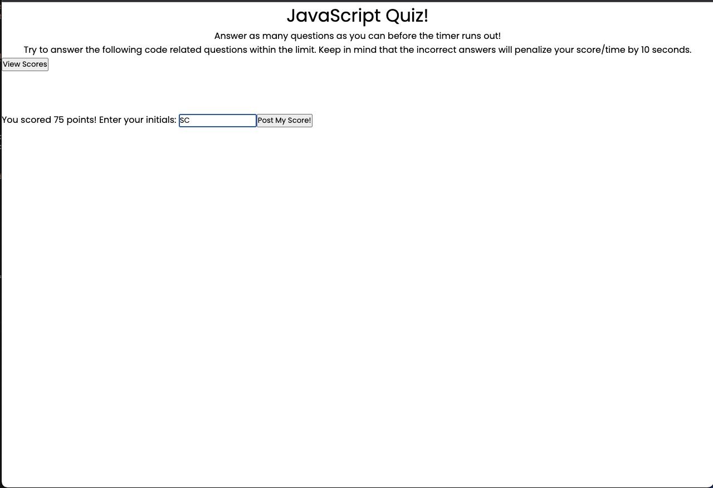
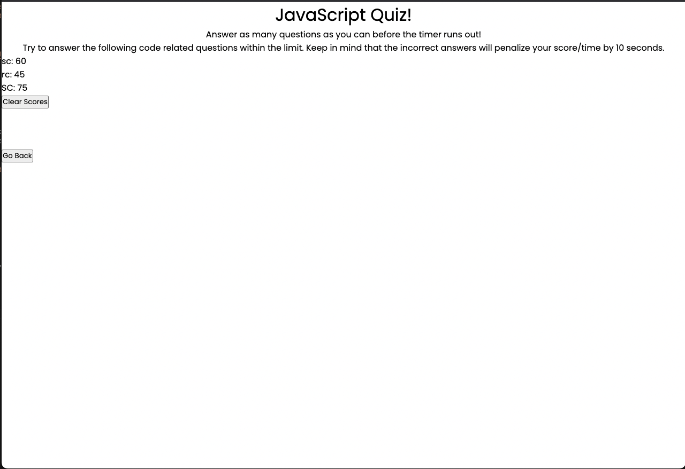

# User Story

AS A coding boot camp student
I WANT to take a timed quiz on JavaScript fundamentals that stores high scores
SO THAT I can gauge my progress compared to my peers

# Acceptance Criteria

GIVEN I am taking a code quiz
WHEN I click the start button
THEN a timer starts and I am presented with a question
WHEN I answer a question
THEN I am presented with another question
WHEN I answer a question incorrectly
THEN time is subtracted from the clock
WHEN all questions are answered or the timer reaches 0
THEN the game is over
WHEN the game is over
THEN I can save my initials and score

## 📝 Notes

Thesis/Motivation:
    
    Our motivation was to create a quiz application for the user to answer Javascript questions, and while this quiz is running we want to have a timer going. The user will traverse this multiple choice quiz, and correct answers increase score, while incorrect answers take time off 
    the clock. Then, the user can input initials and record their score!

How we accomplished this:
        Pseudocode for Quiz App

        1. Create Welcome Page
        a.create a game explanation
        b. create a start quiz button
            I if clicked start the quiz
            II once the quiz starts start the 90 secs countdown
            II refer to point #2 =>
        c. create a viewscores
            I go to view score screen
            II create a 'back' button
            III create a list of scores with initials and points
            IV refer to pint #4 =>
            

        2. Create questions/answers page
        a. hide the game explanation
        b. display questions and answers
            I loop data from an array
            II display the array content on the screen dynamically
            III create button for the answers
            IV when anwser is clicked execute a method i.e. function checkAnswers()
            V check if answer is right or wrong then move forward
            VI if wrong take time away from countdown
            VII once completed move to #3 =>
            VII if timer is out move to #3 =>

        3. Create End Screen
        a. if user moves to end scren due to running out of time; display "time out message"
        b. if user moves to end screen by answering all questions on time "final congrats message"
        c. ask to record the user score and initial
        d. add the start quiz button in case they want to play again

        4.Create high scores to display

Completed Application Screenshots!

Welcome page:

;

Questions:
;
;
;
;
;

End Screen/Input Scores/Initials:
;

List of Scores: 
;

# Link to Github Repo: 
https://github.com/shababrc/Code-Quiz

# Link to deployed page:
https://shababrc.github.io/Code-Quiz/

